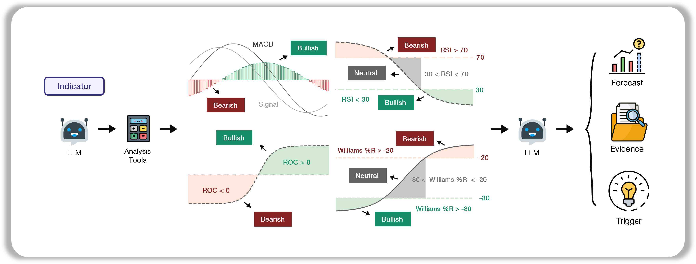

<div align="center">


<h1>QuantAgent: 基于价格驱动的多智能体大语言模型高频交易系统</h1>

</div>

<div align="center">

<p>
    <a href="https://machineily.github.io/">Fei Xiong</a><sup>1,2 ★</sup>&nbsp;
    <a href="https://wyattz23.github.io">Xiang Zhang</a><sup>3 ★</sup>&nbsp;
    <a href="https://scholar.google.com/citations?user=hFhhrmgAAAAJ&hl=en">Aosong Feng</a><sup>4</sup>&nbsp;
    <a href="https://intersun.github.io/">Siqi Sun</a><sup>5</sup>&nbsp;
    <a href="https://chenyuyou.me/">Chenyu You</a><sup>1</sup>
</p>
  
<p>
    <sup>1</sup> 石溪大学 &nbsp;&nbsp;
    <sup>2</sup> 卡内基梅隆大学 &nbsp;&nbsp;
    <sup>3</sup> 不列颠哥伦比亚大学 &nbsp;&nbsp; <br>
    <sup>4</sup> 耶鲁大学 &nbsp;&nbsp;
    <sup>5</sup> 复旦大学 &nbsp;&nbsp;
    ★ 同等贡献 <br>
</p>

<div style="margin: 20px 0;">
  <a href="README.md">English</a> | <a href="README_CN.md">中文</a>
</div>

<p align="center">
  <a href="https://arxiv.org/abs/2509.09995">
    
  </a>
  <a href="https://Y-Research-SBU.github.io/QuantAgent">
    
  </a>
  <a href="https://github.com/Y-Research-SBU/QuantAgent/blob/main/assets/wechat_1025.jpg">
    
  </a>
  <a href="https://discord.gg/t9nQ6VXQ">
    
  </a>
</p>

</div>

一个先进的多智能体交易分析系统，它利用 LangChain 和 LangGraph 结合了技术指标、形态识别和趋势分析。该系统同时提供 Web 界面和编程接口，以实现全面的市场分析。

<div align="center">

🚀 [功能特性](#-功能特性) | ⚡ [安装](#-安装) | 🎬 [使用方法](#-使用方法) | 🧪 [策略详解](STRATEGY_CN.md) | 🔧 [实现细节](#-实现细节) | 🤝 [如何贡献](#-如何贡献) | 📄 [许可证](#-许可证)

</div>

## 🚀 功能特性

### 指标智能体
- **功能**: 在每个传入的K线上计算五个关键技术指标，包括评估动量极值的RSI、量化收敛-发散动态的MACD，以及衡量收盘价与近期交易范围关系的随机振荡器，将原始OHLC数据转化为精确的、可用于信号的度量标准。


  
### 形态智能体
- **功能**: 在收到形态查询后，该智能体首先绘制近期价格图表，识别主要高点、低点和总体趋势，然后将图表形状与一组已知形态进行比较，并以简洁的自然语言返回最佳匹配的描述。


  
### 趋势智能体
- **功能**: 利用工具生成的带有注释的K线图，这些图表上叠加了拟合的趋势通道（追踪近期高点和低点的上下边界线），以量化市场方向、通道斜率和整理区域，最终提供关于当前趋势的简洁、专业的总结。


### 决策智能体
- **功能**: 综合来自指标、形态、趋势和风险智能体的输出——包括动量指标、检测到的图表形态、通道分析和风险回报评估——以制定可行的交易指令，明确指定做多或做空头寸、建议的入场和出场点、止损阈值，并提供基于各智能体发现的简洁理由。


### Web 界面
- 一个基于 Flask 的现代化 Web 应用程序，具备以下功能：
  - 来自雅虎财经的实时市场数据。
  - 交互式资产选择（股票、加密货币、商品、指数）。
  - 多时间框架分析（从1分钟到1天）。
  - 动态图表生成。
  - API 密钥管理。

## ⚡ 安装

### 1. 创建并激活 Conda 环境
```bash
conda create -n quantagents python=3.10
conda activate quantagents
```

### 2. 安装依赖
```bash
pip install -r requirements.txt
```
如果您在安装 `TA-lib-python` 时遇到问题，请尝试：
```bash
conda install -c conda-forge ta-lib
```
或访问 [TA-Lib Python 仓库](https://github.com/ta-lib/ta-lib-python) 获取详细的安装说明。

### 3. 设置 OpenAI API 密钥
您可以在我们的 Web 界面中稍后设置，


或者将其设置为环境变量：
```bash
export OPENAI_API_KEY="您的_API_密钥"
```

## 🎬 使用方法

### 启动 Web 界面
```bash
python web_interface.py
```
Web 应用程序将在 `http://127.0.0.1:5000` 上可用。

### Web 界面功能
1. **资产选择**: 从股票、加密货币、商品和指数中选择。
2. **时间框架选择**: 分析从1分钟到每日的时间间隔数据。
3. **日期范围**: 为分析选择自定义的日期范围。
4. **实时分析**: 获取带可视化的全面技术分析。
5. **API 密钥管理**: 通过界面更新您的 OpenAI API 密钥。

## 📺 演示


## 🔧 实现细节
**重要提示**: 我们的模型需要一个能够接收图像作为输入的 LLM，因为我们的智能体会生成并分析可视化图表以进行形态识别和趋势分析。

### Python 代码中使用
要在您的代码中使用 QuantAgents，可以导入 `trading_graph` 模块并初始化一个 `TradingGraph()` 对象。`.invoke()` 函数将返回一份全面的分析。您可以运行 `web_interface.py`，这里还有一个快速示例：
```python
from trading_graph import TradingGraph

# 初始化交易图
trading_graph = TradingGraph()

# 使用您的数据创建初始状态
initial_state = {
    "kline_data": 您的_dataframe_字典,
    "analysis_results": None,
    "messages": [],
    "time_frame": "4hour",
    "stock_name": "BTC"
}

# 运行分析
final_state = trading_graph.graph.invoke(initial_state)

# 访问结果
print(final_state.get("final_trade_decision"))
print(final_state.get("indicator_report"))
print(final_state.get("pattern_report"))
print(final_state.get("trend_report"))
```

您还可以调整默认配置来设置您自己选择的 LLM、分析参数等。
```python
from trading_graph import TradingGraph
from default_config import DEFAULT_CONFIG

# 创建自定义配置
config = DEFAULT_CONFIG.copy()
config["agent_llm_model"] = "gpt-4o-mini"  # 为智能体使用不同的模型
config["graph_llm_model"] = "gpt-4o"       # 为图逻辑使用不同的模型
config["agent_llm_temperature"] = 0.2      # 调整智能体的创造力水平
config["graph_llm_temperature"] = 0.1      # 调整图逻辑的创造力水平

# 使用自定义配置初始化
trading_graph = TradingGraph(config=config)

# 使用自定义配置运行分析
final_state = trading_graph.graph.invoke(initial_state)
```
对于实时数据，我们建议使用 Web 界面，因为它通过 `yfinance` 提供了对实时市场数据的访问。系统会自动获取最近的30根蜡烛图，以实现最佳的 LLM 分析精度。

### 配置选项
系统支持以下配置参数：
- `agent_llm_model`: 单个智能体的模型 (默认: "gpt-4o-mini")
- `graph_llm_model`: 图逻辑和决策制定的模型 (默认: "gpt-4o")
- `agent_llm_temperature`: 智能体响应的温度 (默认: 0.1)
- `graph_llm_temperature`: 图逻辑的温度 (默认: 0.1)

**注意**: 系统使用默认的 token 限制进行综合分析，不施加人为的 token 限制。

您可以在 `default_config.py` 中查看完整的配置列表。

## 🤝 如何贡献
1. Fork 本仓库
2. 创建一个新的功能分支
3. 提交您的更改
4. 如果适用，请添加测试
5. 提交一个 Pull Request

## 📄 许可证
本项目采用 MIT 许可证 - 详情请参阅 [LICENSE](LICENSE) 文件。

## 🔖 引用
```
@article{xiong2025quantagent,
  title={QuantAgent: Price-Driven Multi-Agent LLMs for High-Frequency Trading},
  author={Fei Xiong and Xiang Zhang and Aosong Feng and Siqi Sun and Chenyu You},
  journal={arXiv preprint arXiv:2509.09995},
  year={2025}
}
```

## 🙏 致谢
本仓库基于 [**LangGraph**](https://github.com/langchain-ai/langgraph), [**OpenAI**](https://github.com/openai/openai-python), [**yfinance**](https://github.com/ranaroussi/yfinance), [**Flask**](https://github.com/pallets/flask), [**TechnicalAnalysisAutomation**](https://github.com/neurotrader888/TechnicalAnalysisAutomation/tree/main) 和 [**tvdatafeed**](https://github.com/rongardF/tvdatafeed) 构建。

## ⚠️ 免责声明
本软件仅用于教育和研究目的，不构成任何财务建议。在做出投资决策前，请务必进行自己的研究并咨询财务顾问。

## 🐛 问题排查

### 常见问题
1. **TA-Lib 安装**: 如果您在安装 TA-Lib 时遇到问题，请参考[官方仓库](https://github.com/ta-lib/ta-lib-python)获取特定平台的安装说明。
2. **OpenAI API 密钥**: 确保您的 API 密钥已在环境变量中或通过 Web 界面正确设置。
3. **数据获取**: 系统使用雅虎财经获取数据，某些交易对可能无法获取或历史数据有限。
4. **内存问题**: 对于大型数据集，请考虑缩小分析窗口或使用更小的时间框架。

### 寻求支持
如果您遇到任何问题，请：
1. 查看上述问题排查部分。
2. 检查控制台中的错误信息。
3. 确保所有依赖项已正确安装。
4. 验证您的 OpenAI API 密钥是否有效且有足够的信用额度。

## 📧 联系方式
如有任何问题、反馈或合作机会，请联系：
**邮箱**: [chenyu.you@stonybrook.edu](mailto:chenyu.you@stonybrook.edu), [siqisun@fudan.edu.cn](mailto:siqisun@fudan.edu.cn)

## ⭐ Star 历史
[](https://www.star-history.com/#Y-Research-SBU/QuantAgent&Date)
